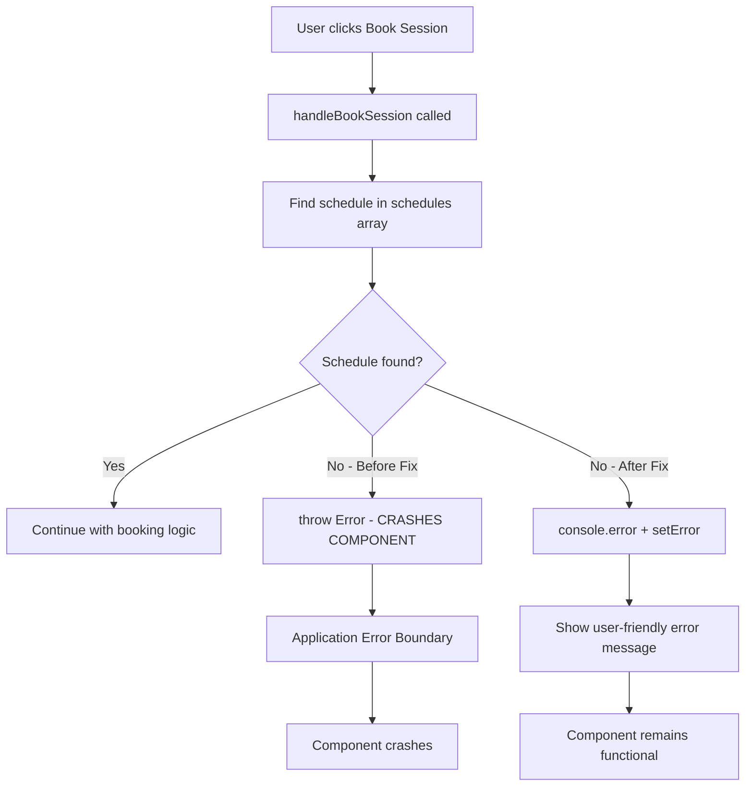

# Fix LIFTING-CLIENT-G: Handle schedule not found error gracefully

## Summary
Fixed a critical error in the SchedulePage component where an unhandled error was being thrown when a schedule was not found, causing the entire component to crash. The error has been replaced with proper error handling that shows a user-friendly message and prevents component crashes.

## Technical Notes
- **Root Cause**: The `handleBookSession` function in SchedulePage was throwing an unhandled error when a schedule ID was not found in the available schedules array
- **Fix**: Replaced the `throw error` with proper error handling using `console.error` for logging and `setError` for user feedback
- **Error Prevention**: Added graceful degradation to prevent component crashes
- **Testing**: Added comprehensive test coverage to ensure the error handling works correctly

## Changes Made
- Modified `client/src/pages/SchedulePage.tsx` to handle missing schedules gracefully
- Added `client/src/tests/SchedulePageError.test.tsx` with test coverage for the error scenario
- Error now logs to console and displays user-friendly message instead of crashing

## How the Fix Works

## Testing
- **Added 1 test**: `SchedulePageError.test.tsx` - Tests error handling for missing schedules
- **Test Coverage**: Ensures component doesn't crash when schedule is not found
- **Manual Testing**: Visit the schedule page, trigger booking with missing schedule data

## Human Testing Instructions
1. Visit the schedule page at `/schedule`
2. If you can simulate a race condition where a schedule gets removed after the page loads, the error should now show a friendly message instead of crashing
3. Expected behavior: Error message displays "Schedule not found. Please refresh the page and try again."
4. Page remains functional and doesn't crash

## Related Issues
- Sentry Issue: LIFTING-CLIENT-G
- Issue URL: https://us.sentry.io/organizations/tfw-v1/issues/LIFTING-CLIENT-G
